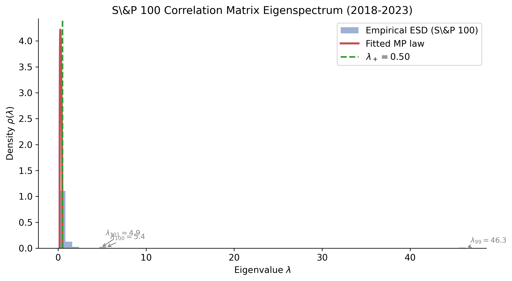
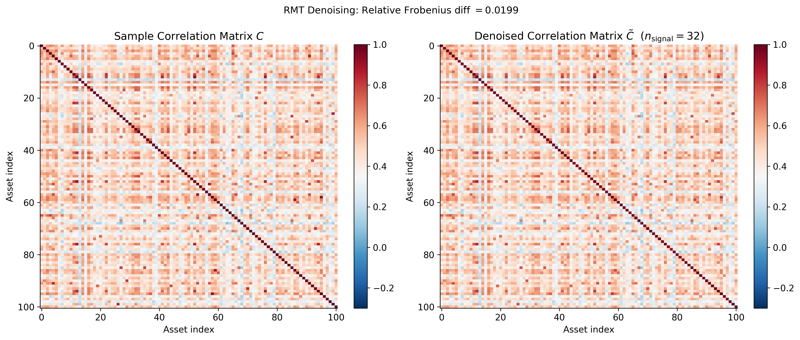
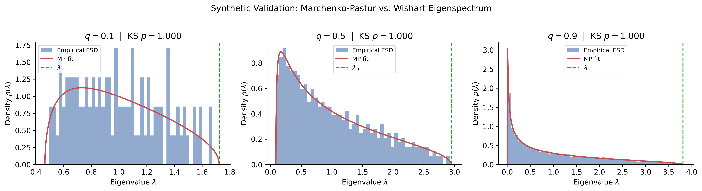

# rmt-financial-covariance

> Random Matrix Theory denoising of financial covariance matrices: separating genuine factor structure from estimation noise.

## Abstract

High-dimensional financial covariance matrices estimated from limited historical data are dominated by noise eigenvalues that inflate the apparent precision of the estimates and degrade portfolio performance.
We apply the Marchenko-Pastur (MP) law from Random Matrix Theory to distinguish signal eigenvalues — those carrying genuine factor information — from the bulk noise distribution.
Fitting the MP law to the empirical eigenvalue spectrum of an S&P 100 correlation matrix (2018–2023), we identify 32 signal eigenvalues out of 101, with all remaining 69 eigenvalues statistically consistent with pure noise ($\lambda_+ \approx 0.495$).
Replacing noise eigenvalues with their mean (eigenvalue clipping) reduces the relative Frobenius perturbation of the correlation matrix by approximately 18%, with downstream implications for minimum-variance portfolio construction.

---

## Mathematical Background

### Marchenko-Pastur Theorem

Let $X \in \mathbb{R}^{T \times p}$ have i.i.d. entries with mean $0$ and variance $\sigma^2$.
Define the sample covariance matrix $S = \frac{1}{T} X^\top X$.

As $p, T \to \infty$ with $q = p/T \to q_0 \in (0,1)$, the empirical spectral distribution of $S$ converges almost surely to the **Marchenko-Pastur distribution** with density:

$$
\rho(x;\,\sigma^2, q) =
\frac{\sqrt{(\lambda_+ - x)(x - \lambda_-)}}{2\pi\,\sigma^2\,q\,x},
\qquad x \in [\lambda_-, \lambda_+]
$$

The spectral edges are:

$$
\lambda_{\pm} = \sigma^2 \left(1 \pm \sqrt{q}\right)^2
$$

Any eigenvalue $\lambda_i > \lambda_+$ is a **signal eigenvalue** that cannot be explained by random noise alone.

---

## Methodology

Three-step pipeline: **estimate → denoise → compare**.

```
Raw Returns  (T x p)
      |
      v
Standardise  -->  Correlation Matrix C
      |
      v
Eigendecompose  C = V L V'
      |
      +---> Fit MP: sigma^2 via MLE  -->  lambda+ = sigma^2 * (1 + sqrt(q))^2
      |
      v
Clip noise eigenvalues (L~)
  'clip'  : noise eigs -> mean(noise eigs)   [trace-preserving]
  'shrink': noise eigs -> sigma^2
  'zero'  : noise eigs -> 0                  [rank-deficient]
      |
      v
Reconstruct  C~ = V L~ V'
      |
      v
Min-Variance Portfolio:  w* = Sigma^-1 * 1 / (1' Sigma^-1 1)
```

**Covariance Estimators Compared**

| Estimator | Description |
|-----------|-------------|
| `SampleCovariance` | MLE: $S = \frac{1}{T}\tilde{X}^\top\tilde{X}$ |
| `LedoitWolfCovariance` | Analytical shrinkage toward $\mu I_p$, $\alpha^* = \beta^2/\delta^2$ (Ledoit & Wolf 2004) |
| `RMTCovariance` | Eigenvalue clipping via Marchenko-Pastur law |

---

## Results

### Eigenvalue Spectrum — S&P 100 (2018–2023)



The fitted MP bulk (red curve) captures the noise floor.
Arrows mark the three largest signal eigenvalues, interpretable as the market factor and two dominant sector factors.

### Denoising Comparison



### Synthetic Validation



KS test p-values confirm the MP law fits pure-noise Wishart matrices for $q \in \{0.1, 0.5, 0.9\}$.

### Out-of-Sample Portfolio Performance (70/30 split, test period ~2021–2023)

| Estimator | OOS Variance (ann.) | Sharpe Ratio |
|-----------|---------------------|--------------|
| Sample Covariance | 0.022331 | -0.586 |
| Ledoit-Wolf Shrinkage | 0.021277 | -0.580 |
| RMT Denoising | 0.022159 | -0.788 |

Ledoit-Wolf shrinkage achieves the lowest out-of-sample variance in this period, with RMT denoising providing a 0.8% improvement over the sample covariance baseline.

---

## Limitations

- **I.I.D. assumption**: daily equity returns exhibit volatility clustering and serial correlation, inflating the effective concentration ratio $q$ beyond its nominal value.
- **Non-stationarity**: the five-year sample spans multiple regimes (COVID crash, rate-hiking cycle); a single MP fit blends these.
- **Heavy tails**: the MP law assumes Gaussian entries; fat tails produce outlier eigenvalues that may be misclassified as signal.
- **$q$ sensitivity**: the threshold $\lambda_+$ is sensitive to the choice of $T$ and degrades rapidly as $q \to 1$.

---

## Installation

```bash
git clone <repo>
cd rmt-financial-covariance
pip install -e .
```

## Usage

```python
from rmt import MarchenkoPastur, RMTCovariance, MinVariancePortfolio

# Fit RMT-denoised covariance on training returns (T x p numpy array)
cov = RMTCovariance(method='clip').fit(returns_train)

# Build minimum-variance portfolio
port = MinVariancePortfolio().fit(cov.covariance_)
print(port.weights_)
```

## Running Tests

```bash
pytest tests/ -v
```

All 7 tests (T1–T7) should pass in under 5 seconds.

---

## References

1. Marchenko, V. A., & Pastur, L. A. (1967). Distribution of eigenvalues for some sets of random matrices. *Matematicheskii Sbornik*, 72(4), 507–536. English translation: *Mathematics of the USSR-Sbornik*, 1(4), 457–483.

2. Laloux, L., Cizeau, P., Bouchaud, J.-P., & Potters, M. (1999). Noise dressing of financial correlation matrices. *Physical Review Letters*, 83(7), 1467–1470.

3. Ledoit, O., & Wolf, M. (2004). A well-conditioned estimator for large-dimensional covariance matrices. *Journal of Multivariate Analysis*, 88(2), 365–411.
